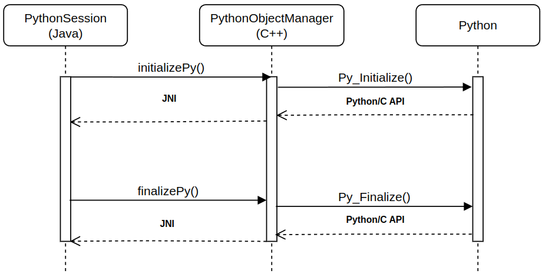

# Java-Python Integration Library

This library provides tools for Java-Python integration, including:

* **Python interpreter control**
    * Initialize and finalize Python interpreter from Java
    * Handle exceptions that were thrown from
        * The Python interpreter
        * Native (JNI) code
* **Python objects management**
    * Automatic reference counting for Python objects
    * Flexible Python objects release from Java (both semi-automatic and manual)
* **Conversion between Java and Python**
    * Primitive types (`int`, `float`, `bool`, `str`)
    * Collections (`list`, `tuple`, `dict`, `set`)
    * Custom types
* **Invocation of callable objects**
    * Calling Python functions and methods from Java.
    * Invoke Java functional interfaces from Python interpreter

## How it works

### Python interpreter initialization

The Python interpreter runs within the same process as the JVM using **JNI** and C++ layer with **Python/C API**.



`PythonSession` is a Java class that manages the lifecycle of the embedded Python interpreter. Upon instantiation, it invokes the native function `initializePy()`, which performs the following key operations:

* Initializes the Python interpreter using the standard `Py_Initialize()`.

* Sets up a global `PythonObjectManager` to handle `PyObject` references, ensuring safe interaction with Python objects.

```Java
try (PythonSession pythonSession = new PythonSession()) {
    // Python operations
} // Cleaning Python objects
```

The class implements `AutoClosable` interface, allowing it to be used in try-with-resources blocks for automatic resource management.

When `close()` is called, it triggers the native `finalizePy()` function, which cleans up Python environment:

* Releases all `PyObject` references allocated from current session.

* Properly shuts down the interpreter via `Py_Finalize()`.

For convenient interpreter operations, the library provides the `PythonCore` Java class, offering essential functionalities such as:

* Module imports

* Python objects creation and deletion

### Memory management

Python automatically frees object when their reference count reaches zero. When using **Python/C API** from Java, manual reference management is required.

1. **Manual**

    ```Java
    IPythonObject object = PythonCore.evaluate("1");
    PythonCore.free(object); // Explicitly decrements reference count
    ```

2. **Semi-automatic**

    An object frees when the scope closes unless the `keepAlive()` method is called, which moves the object to the parent scope.

    ```Java
    try (PythonScope pythonScope1 = new PythonScope()) {
        IPythonObject object1;
        try (PythonScope pythonScope2 = new PythonScope()) {
            object1 = PythonCore.evaluate("1").keepAlive();   // Accessible in pythonScope1
            IPythonObject object2 = PythonCore.evaluate("2"); // Freed when pythonScope2 closes
        }
    }
    ```

## Installation

Currently, the library is only supported on Linux.

### Edit Makefile

```Makefile
# Change to your Python version (39 for Python 3.9 etc.)
CXXFLAGS= ... -DPYTHON_VERSION=312

# Path to your Python and JVM
INCLUDES= ... -I/usr/include/python{VERSION} \
            -I${JAVA_HOME}/include \
            -I${JAVA_HOME}/include/linux
```

Also change `-lpython3.12` to your Python version.

### Build

Build library using

```bash
# Builds both Java and native components
./gradlew build
```

Built files location: `build/libs/`

### Usage

Add `java_python_lib-1.0-SNAPSHOT.jar` to classpath and make sure that `libnative.so` is in your `java.library.path`.

## Examples

Usage examples are available in [examples](./examples) directory:

* **Basic Java-Python calls** – modules and functions.
* **Coverage tracking** – track executed lines from Java.
* **Parallel execution** – Python threading with Java functions

To run the examples, use `./gradlew :examples:run`

## Dependencies

* Java 11+
* Python 3.9+
